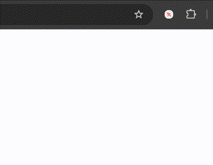
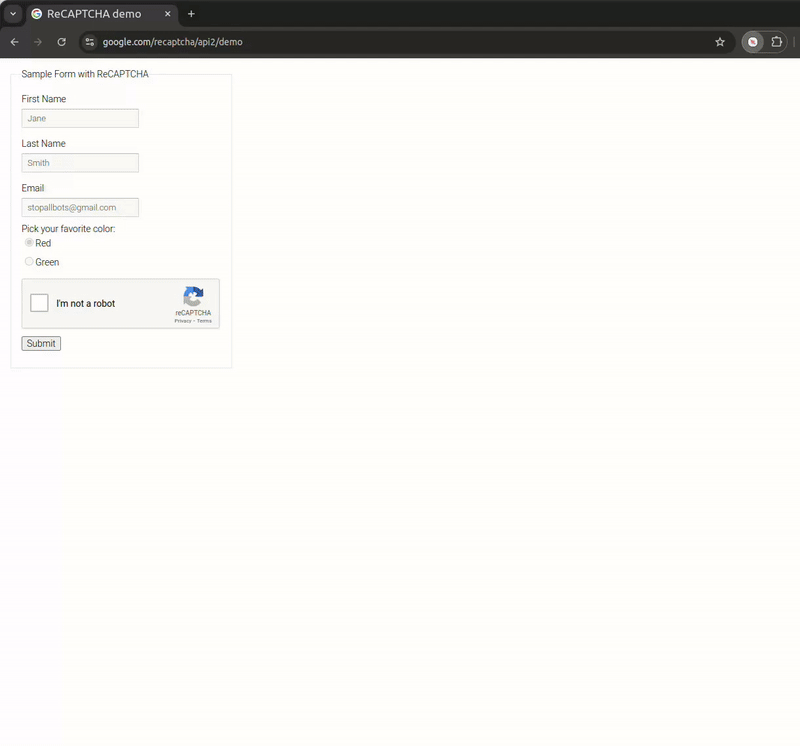
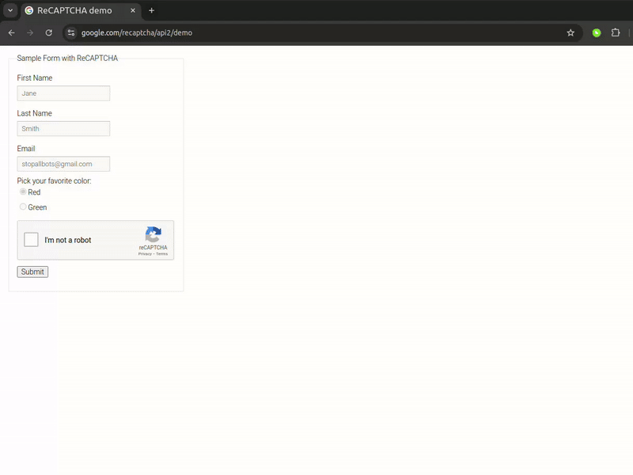

# ReCaptcha Region Clicker

A Chrome extension for personal use that assists with reCAPTCHA v2 image verification by enabling region-based selection and clicking.

Blog post: https://www.naveen.ing/recaptcha-clicker/

## Features

- Region-based selection
- Quick toggle with Alt+R shortcut
- Compatible with 3x3 and 4x4 reCAPTCHA grids
- Visual click feedback

## Installation

1. Clone this repo
2. Visit `chrome://extensions/`
3. Enable "Developer mode"
4. Click "Load unpacked"
5. Select extension directory

## Usage Instructions

1. Navigate to a page with reCAPTCHA
2. Press Alt+R to activate
3. Hold Shift and select matching image regions
4. Release to process selection

Use the [official ReCaptcha demo site](https://www.google.com/recaptcha/api2/demo) to test it.  

## Demo

## Development

Built using vanilla JavaScript and Chrome Extension APIs:
- `content.js`: Core selection/clicking logic
- `background.js`: Extension lifecycle management
- `popup`: Basic control interface

## Important Notice

This tool is designed for **PERSONAL USE ONLY** and should be used responsibly and ethically. It is intended as a learning resource and accessibility aid, not a means to bypass security systems.

This is a **read-only repository**. No issues, pull requests, or discussions are being accepted.

Feel free to fork and modify for your personal use.

## Legal Disclaimer

### License
This project is licensed under the MIT License, subject to the following conditions and disclaimers.

Conditions of Use

1. This software is for personal, non-commercial use only
2. Users must comply with all applicable website terms of service
3. The software may not be used for automated bulk operations
4. Users must ensure their use complies with local laws and regulations

### Disclaimer of Liability
THE SOFTWARE IS PROVIDED "AS IS", WITHOUT WARRANTY OF ANY KIND. THE AUTHORS AND CONTRIBUTORS:

1. Make no warranties regarding functionality, reliability, or accuracy
2. Accept no liability for any damages arising from use
3. Do not guarantee compatibility with any website or service
4. Are not responsible for any consequences of use
5. Provide no assurance of continued functionality

### Additional Disclaimers
1. This tool is not intended to:
   - Circumvent security measures
   - Facilitate unauthorized access
   - Generate automated traffic
   - Violate any terms of service

2. Users acknowledge that:
   - They assume all risks associated with use
   - They will use the tool responsibly and ethically
   - They will comply with all applicable laws
   - They will respect website terms of service

### Limitation of Liability
IN NO EVENT SHALL THE AUTHORS, COPYRIGHT HOLDERS, OR CONTRIBUTORS BE LIABLE FOR ANY:
- Direct, indirect, or consequential damages
- Loss of data, profits, or use
- Business interruption
- Any other commercial damages or losses

ARISING FROM OR IN CONNECTION WITH THE USE OR PERFORMANCE OF THIS SOFTWARE.

## Contributing

Contributions are welcome through Pull Requests. Please ensure your contributions align with the project's intended personal-use nature and ethical guidelines.

---

By using this software, you acknowledge that you have read, understood, and agreed to all terms and conditions stated above.

